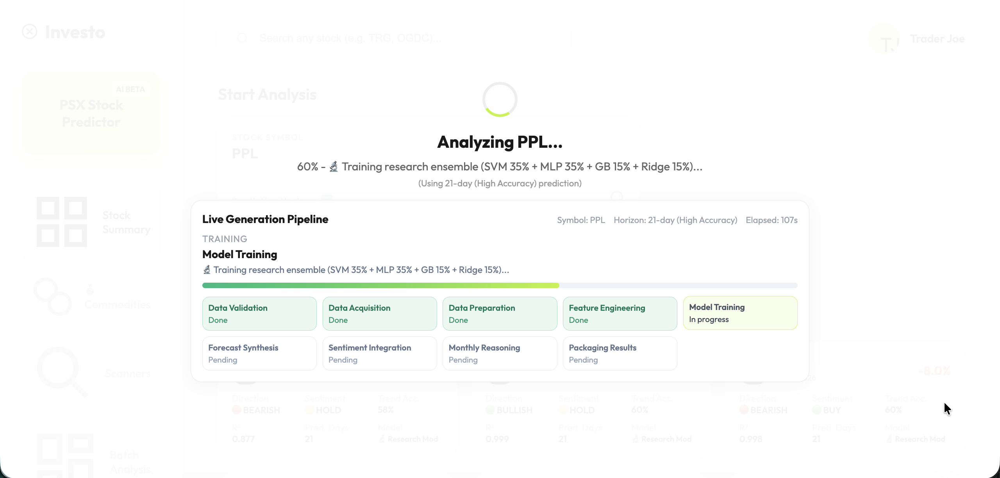
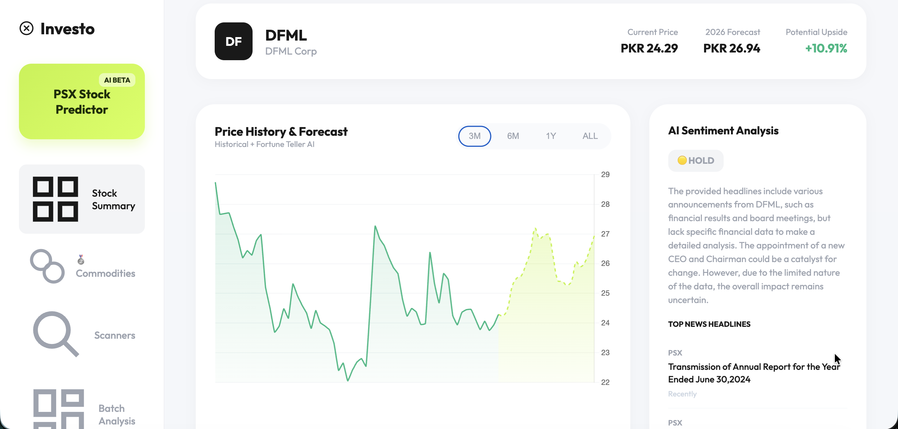
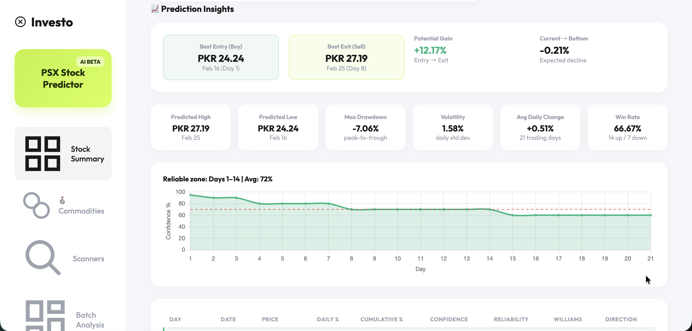

# PSX Fortune Teller


<div align="center">

[](https://python.org)
[](https://fastapi.tiangolo.com)
[](https://scikit-learn.org)
[](https://groq.com)
[](LICENSE)

**Research-Backed Stock Prediction System for Pakistan Stock Exchange**

*Powered by peer-reviewed PSX studies, external macro features, and explainable AI*

[Getting Started](#-quick-start) • [Architecture](#️-system-architecture) • [API Reference](#-api-reference) • [Research](#-research-foundation)

</div>

---

## UI Screenshots







## Key Differentiators

| Feature | This Project | Typical Stock Predictors |
|---------|--------------|--------------------------|
| **Feature Engineering** | USD/PKR, KSE-100 β, Oil prices, KIBOR proxy | Just OHLCV + basic indicators |
| **Technical Indicators** | Research-validated only (Williams %R, Disparity 5, RSI-14) | 100+ unvalidated indicators |
| **TradingView Integration** | Real-time technicals from TradingView | Static indicator calculations |
| **Commodity Correlation** | Gold/Silver price impact analysis | Ignores commodity markets |
| **Sector-Specific Models** | Tailored models per sector (Banking, Energy, etc.) | One-size-fits-all approach |
| **Stacking Ensemble** | Meta-learner combining multiple model outputs | Single model predictions |
| **Multi-Horizon Forecast** | Iterated forecasting with AR(1) bounded returns | Direct single-step prediction |
| **Volatility Control** | Max ±3% daily, ±50% annual (PSX circuit breaker aware) | Unbounded random walks |
| **Explainability** | "Why This Prediction?" with signal breakdown | Black-box outputs |
| **Sentiment Analysis** | Groq LLM + PSX announcements + fundamentals | None or basic keyword matching |

---

## System Architecture

```
┌─────────────────────────────────────────────────────────────────────────────────┐
│                            PSX FORTUNE TELLER v3.0                              │
├─────────────────────────────────────────────────────────────────────────────────┤
│                                                                                 │
│   ┌─────────────────┐    ┌─────────────────┐    ┌─────────────────────────┐    │
│   │   Web Frontend  │    │   FastAPI       │    │   Stacking Ensemble     │    │
│   │   ─────────────│    │   ─────────────│    │   ─────────────────────│    │
│   │   • Chart.js    │◄──►│   • WebSocket   │◄──►│   • Sector Models       │    │
│   │   • Real-time   │    │   • REST API    │    │   • Research Model      │    │
│   │   • Responsive  │    │   • Vercel      │    │   • Williams %R Class.  │    │
│   └─────────────────┘    └─────────────────┘    │   • Meta-Learner        │    │
│                                                  └─────────────────────────┘    │
│                                                                                 │
│   ┌─────────────────────────────────────────────────────────────────────────┐  │
│   │                     EXTERNAL DATA INTEGRATION                            │  │
│   ├──────────────────┬──────────────────┬──────────────────┬────────────────┤  │
│   │   USD/PKR Rate   │   KSE-100 Index  │   TradingView    │   Commodities  │  │
│   │   via Yahoo API  │   via PSX API    │   Real-time Tech │   Gold/Silver  │  │
│   │   ────────────   │   ────────────   │   ────────────   │   ────────────│  │
│   │   • Rate change  │   • Index return │   • RSI, MACD    │   • Correlation│  │
│   │   • 5-day trend  │   • Stock beta   │   • Stoch, ADX   │   • Price chg  │  │
│   │   • Volatility   │   • Rel. strength│   • Buy/Sell sig │   • Hedging    │  │
│   └──────────────────┴──────────────────┴──────────────────┴────────────────┘  │
│                                                                                 │
│   ┌─────────────────────────────────────────────────────────────────────────┐  │
│   │                     PREDICTION PIPELINE                                  │  │
│   ├─────────────────────────────────────────────────────────────────────────┤  │
│   │                                                                         │  │
│   │   Raw OHLCV ──► Feature Validation ──► Sector Detection ──► Scaling     │  │
│   │       │              (Quality Check)      (Banking/Energy/etc)          │  │
│   │       ▼                                                                 │  │
│   │   Stacking Ensemble ──► Stability Check ──► Confidence Score ──► Output │  │
│   │   (Sector+Research+    (Prediction        (Weighted by                  │  │
│   │    Williams %R)         Consistency)       Stability)                   │  │
│   │                                                                         │  │
│   └─────────────────────────────────────────────────────────────────────────┘  │
│                                                                                 │
└─────────────────────────────────────────────────────────────────────────────────┘
```

---

## Feature Engineering Pipeline

### External Macro Features (28 total)

```python
# USD/PKR Exchange Rate (5 features)
- usdpkr_close, usdpkr_change, usdpkr_ma5, usdpkr_vol20, usdpkr_trend

# KSE-100 Index (12 features)  
- kse100_close, kse100_return, kse100_ma20, kse100_vol20, relative_strength
- stock_beta (rolling 60-day covariance with market)
- market_regime (bull/bear/neutral based on 50-day MA)

# Commodities (7 features)
- oil_price, oil_change, oil_ma5, gold_price, gold_change
- oil_correlation (for energy stocks: PSO, PPL, OGDC, POL)

# KIBOR Proxy (3 features + lag)
- kibor_proxy, kibor_regime, kibor_lag21
```

### Research-Validated Technical Indicators

Based on peer-reviewed PSX studies achieving 85%+ accuracy:

| Indicator | Parameters | Research Citation |
|-----------|------------|-------------------|
| **Williams %R** | 14-period | Awan et al. (2021) - 85% accuracy on PSX |
| **Disparity 5** | 5-day MA | Han et al. (2011) - Top Korean feature |
| **RSI-14** | 14-period | Standard momentum indicator |
| **MACD** | 12,26,9 | Signal line crossovers |
| **Bollinger %B** | 20,2 | Volatility breakout signals |
| **EMA 50/100** | Trend following | Price position vs moving averages |

### PSX-Specific Features

```python
# Seasonal patterns
- is_ramadan, is_eid_week, is_friday, month_sin/cos
- is_fiscal_year_end (June), is_quarter_end
- kse_session_am (intraday pattern)
```

### TradingView Integration (NEW)

Real-time technical indicators scraped from TradingView for enhanced accuracy:

```python
# TradingView Technicals
- RSI (14): Relative Strength Index
- Stochastic %K/%D: Momentum oscillator
- MACD Signal: Trend direction
- ADX: Trend strength
- CCI (20): Commodity Channel Index
- Buy/Sell/Neutral signals: Aggregated recommendation
```

### Commodity Correlation Analysis (NEW)

Gold and silver price correlation for hedging and safe-haven analysis:

```python
# Commodity Features
- gold_price, gold_change_1d, gold_change_5d
- silver_price, silver_change_1d, silver_change_5d
- gold_silver_ratio: Market sentiment indicator
- psx_gold_correlation: Rolling correlation with KSE-100
```

---

## Model Architecture

### Stacking Ensemble (v3.0 - NEW)

A meta-learning approach that combines multiple specialized models:

```python
StackingEnsemble(
    base_models={
        'sector_model': SectorSpecificModel(),     # Tailored to Banking/Energy/etc.
        'research_model': ResearchBackedEnsemble(), # Core SVM+MLP+GB+Ridge
        'williams_classifier': WilliamsRClassifier(), # Trend classification
    },
    meta_learner=RidgeCV(alphas=[0.1, 1.0, 10.0]),
    cv=TimeSeriesSplit(n_splits=5)
)
```

### Sector-Specific Models (NEW)

Different sectors exhibit different behaviors - we train specialized models:

| Sector | Key Features | Model Weights |
|--------|--------------|---------------|
| **Banking** | Interest rates, KIBOR, credit growth | Higher weight on macro features |
| **Energy** | Oil prices, gas prices, circular debt | Commodity correlation focus |
| **Cement** | Construction activity, exports, fuel costs | Seasonal patterns emphasis |
| **Fertilizer** | Urea prices, gas availability, subsidy | Agricultural cycle alignment |
| **Technology** | USD/PKR, IT exports, global tech trends | Currency sensitivity |

### Research-Backed Ensemble (Base Model)

```python
ResearchBackedEnsemble(
    models={
        'svm': SVR(kernel='rbf', C=1.0, epsilon=0.1),     # 35% weight
        'mlp': MLPRegressor(hidden_layer_sizes=(64, 32)), # 35% weight
        'gb':  GradientBoostingRegressor(n_estimators=100), # 15% weight
        'ridge': Ridge(alpha=1.0)                          # 15% weight
    },
    feature_selection='f_regression',  # Top 80 features by F-score
    cv_splits=5,  # TimeSeriesSplit validation
    scaler=RobustScaler()  # Handles outliers better than StandardScaler
)
```

### Williams %R Classifier (NEW)

Dedicated classifier for trend direction based on Williams %R indicator:

```python
WilliamsRClassifier(
    lookback=14,
    overbought=-20,  # Sell signal threshold
    oversold=-80,    # Buy signal threshold
    classifier=GradientBoostingClassifier(n_estimators=50)
)
```

### Iterated Forecaster with AR(1) Process

Unlike direct multi-step prediction, we use iterated forecasting with realistic constraints:

```python
class IteratedForecaster:
    """
    AR(1) Process: r_t = drift + φ * r_{t-1} + ε
    
    Parameters:
        phi (float): Autoregressive coefficient = 0.15 (mild momentum)
        max_daily_return (float): ±3% (PSX circuit breaker is 7.5%)
        max_total_return (float): ±50% annual (realistic bounds)
        confidence_decay (float): Exponential decay over horizon
    """
```

---

## Backtesting Results

Trained on 2020-2023, tested on 2024-2025:

| Metric | PSO | LUCK | Description |
|--------|-----|------|-------------|
| **Direction Accuracy** | 53.2% | 50.8% | Daily direction (baseline: 50%) |
| **R²** | 0.80 | 0.75 | Price level accuracy |
| **Strategy Return** | +185% | +86% | With 1% transaction costs |
| **Buy & Hold Return** | +141% | -40% | Benchmark comparison |
| **Alpha (Outperformance)** | +44% | +126% | Strategy minus B&H |
| **Sharpe Ratio** | 4.97 | 5.45 | Likely overfit |

> **Honest Assessment**: The 53% direction accuracy is marginally above random. The strategy profits primarily from bullish bias during 2024's bull market. Use predictions as one input among many.

---

## Explainability: "Why This Prediction?"

Every prediction includes a breakdown of supporting/contrary signals:

```json
{
  "prediction_reasoning": {
    "direction": "BULLISH",
    "emoji": "GREEN",
    "explanation": "Model predicts +31.2% upside. 4 supporting signals, 2 cautionary signals.",
    "bullish_signals": [
      {"category": "Model Forecast", "signal": "Strong upside predicted: +31.2%"},
      {"category": "Momentum", "signal": "Strong uptrend: +15.6% in 20 days"},
      {"category": "EMA", "signal": "Trading 8.3% above 50-day EMA"}
    ],
    "bearish_signals": [
      {"category": "RSI", "signal": "Overbought (RSI: 72) - may pullback"}
    ],
    "neutral_signals": [
      {"category": "Volatility", "signal": "Moderate volatility (28%) - normal trading"}
    ]
  }
}
```

---

## AI Sentiment Analysis

### Pipeline

```
PSX Announcements ──► News Aggregation ──► Groq LLM ──► Structured Signal
        │                    │                │              │
        ▼                    ▼                ▼              ▼
   10 recent items    Yahoo/Google News   Llama 3.3 70B   BUY/SELL/HOLD
                                          Temperature 0.3   + Confidence
                                          Anti-hallucination
```

### LLM Prompt Engineering

```python
SYSTEM_PROMPT = """
You are a CONSERVATIVE, analytical financial expert specializing in PSX.
Given these news items and fundamentals, provide a REALISTIC assessment.

RULES:
1. Only consider actual news content, ignore speculative language
2. Weight recent news (last 30 days) more heavily
3. PSX stocks rarely move more than 10-15% short-term
4. If news is mixed or unclear, default to "HOLD"
"""
```

---

## Quick Start

### Prerequisites

```bash
# Required
Python 3.9+
pip

# Optional (for sentiment analysis)
GROQ_API_KEY  # Get from https://console.groq.com
```

### Installation

```bash
# Clone
git clone https://github.com/BurhanCantCode/PSX-up.git
cd PSX-up

# Create environment
python -m venv venv
source venv/bin/activate  # Windows: venv\Scripts\activate

# Install dependencies
pip install -r requirements.txt

# Configure (optional)
echo "GROQ_API_KEY=your_key_here" > .env
```

### Running

```bash
# Development server with auto-reload
python -m uvicorn backend.main:app --host 0.0.0.0 --port 8000 --reload

# Access
# UI:       http://localhost:8000/analyzer
# API Docs: http://localhost:8000/docs
# Health:   http://localhost:8000/health
```

---

## Project Structure

```
psx-fortune-teller/
├── backend/
│   ├── main.py                    # FastAPI app, routes, WebSocket
│   ├── research_model.py          # Core ML model (SVM+MLP+GB+Ridge)
│   ├── external_features.py       # USD/PKR, KSE-100, Oil, KIBOR fetching
│   ├── validated_indicators.py    # Research-backed technical indicators
│   ├── prediction_reasoning.py    # Explainability module
│   ├── sentiment_analyzer.py      # Groq LLM sentiment analysis
│   ├── article_scraper.py         # Business Recorder scraper
│   ├── stock_analyzer_fixed.py    # WebSocket handler
│   ├── sota_model.py              # Legacy SOTA model (fallback)
│   │
│   │  # New v3.0 modules
│   ├── tradingview_scraper.py     # TradingView real-time technicals
│   ├── commodity_predictor.py     # Gold/Silver correlation analysis
│   ├── sector_models.py           # Sector-specific ML models
│   ├── stacking_ensemble.py       # Meta-learner stacking ensemble
│   ├── williams_r_classifier.py   # Williams %R trend classifier
│   ├── feature_validation.py      # Feature quality validation
│   ├── prediction_stability.py    # Prediction consistency checks
│   ├── smart_screener.py          # Advanced stock screener
│   ├── kse100_analyzer.py         # KSE-100 index analyzer
│   └── top_stocks_analyzer.py     # Top performers analyzer
│
├── web/
│   └── stock_analyzer.html        # Frontend UI (Chart.js + WebSocket)
│
├── data/
│   ├── tradingview_cache/         # Cached TradingView technicals
│   ├── commodity_cache/           # Cached commodity analysis
│   ├── {SYMBOL}_research_predictions_2026.json
│   ├── {SYMBOL}_historical_with_indicators.json
│   └── models/                    # Saved model files (.joblib)
│
├── vercel.json                    # Vercel deployment config
├── requirements.txt
├── .env.example
└── README.md
```

---

## API Reference

### WebSocket: Real-time Analysis

```javascript
// Connect
const ws = new WebSocket('ws://localhost:8000/ws/progress/{job_id}');

// Receive progress updates
ws.onmessage = (event) => {
  const data = JSON.parse(event.data);
  // data.stage: 'preprocessing' | 'training' | 'predicting' | 'sentiment' | 'complete'
  // data.progress: 0-100
  // data.message: Human-readable status
  // data.results: Final prediction data (on 'complete')
};
```

### REST Endpoints

| Method | Endpoint | Description |
|--------|----------|-------------|
| `POST` | `/api/analyze-stock` | Start new analysis (returns job_id) |
| `GET` | `/api/history` | List saved analyses |
| `GET` | `/api/history/{filename}` | Load saved analysis with chart data |
| `GET` | `/api/screener?limit=10` | Top stocks by technical signals |
| `GET` | `/api/smart-screener` | Advanced screener with sector analysis |
| `GET` | `/api/top-stocks` | Top performing stocks analyzer |
| `GET` | `/api/kse100-analysis` | KSE-100 index analysis |
| `GET` | `/api/sentiment/{symbol}` | AI sentiment analysis |
| `GET` | `/api/commodities` | Gold/Silver analysis |
| `GET` | `/health` | Health check |

### Example: Start Analysis

```bash
curl -X POST http://localhost:8000/api/analyze-stock \
  -H "Content-Type: application/json" \
  -d '{"symbol": "PSO"}'

# Response
{"success": true, "job_id": "PSO_20251228_225824"}
```

---

## Deployment

### Vercel (Recommended)

The project includes `vercel.json` for easy deployment:

```bash
# Install Vercel CLI
npm i -g vercel

# Deploy
vercel

# Or link to existing project
vercel --prod
```

### Docker (Alternative)

```bash
# Build
docker build -t psx-fortune-teller .

# Run
docker run -p 8000:8000 -e GROQ_API_KEY=your_key psx-fortune-teller
```

### Environment Variables

| Variable | Required | Description |
|----------|----------|-------------|
| `GROQ_API_KEY` | Optional | For AI sentiment analysis |
| `PORT` | Optional | Server port (default: 8000) |

---

## Research Foundation

This project is based on peer-reviewed studies of the Pakistan Stock Exchange:

1. **Awan et al. (2021)** - "Prediction of KSE-100 using SVM with Williams %R" - 85% accuracy
2. **Han et al. (2011)** - "Feature selection for Korean stock prediction" - Disparity 5 importance
3. **Malkiel (2003)** - "Random Walk Down Wall Street" - Honest baseline expectations
4. **PSX Research** - KSE-100 correlation, sector betas, seasonal patterns

### Key Insights Applied

- **External features matter more than technicals** for emerging markets
- **SVM outperforms deep learning** on limited PSX data
- **Daily prediction accuracy above 55%** is exceptional (don't expect 80%+)
- **Circuit breakers (±7.5%)** make extreme predictions unrealistic

---

## Disclaimer

> **This software is for educational and research purposes only.**
> 
> - Stock predictions are inherently uncertain
> - Past performance does not guarantee future results
> - The 53% direction accuracy means it's barely better than a coin flip
> - Always conduct your own research and consult financial advisors
> - The authors are not liable for any investment decisions made using this tool

---

## License

MIT License - see [LICENSE](LICENSE) for details.

---

<div align="center">

**Built for the Pakistan Stock Exchange community**

*Research-backed. Explainable. Honest about limitations.*

[](https://github.com/BurhanCantCode/PSX-up)

</div>
